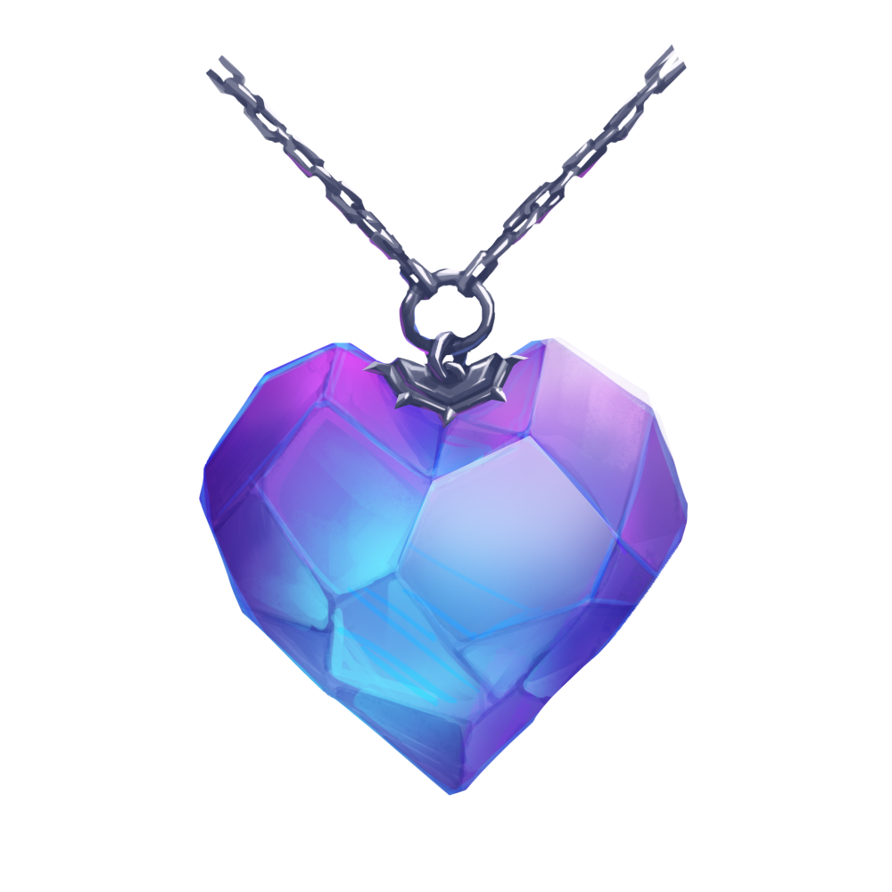

# Vestiges of Vecna
## The Heart

### Properties of the Heart

- Your alignment changes to neutral evil.
- Your Intelligence increases by 1, to a maximum of 24.
- You gain resistance to cold damage.
- You gain proficiency in death saving throws.
- You are immune to disease and poison.
- You gain the ability to cast Enervation at will.

### Amplification

The Heart greatly amplifies the powers of the other two Vestiges while they are attuned to the user.

---

## The Hand

### Properties of the Hand

- Your alignment changes do neutral evil.
- Your Intelligence increases by 1, to a maximum of 24.
- You gain resistance to cold damage.
- You gain proficiency in Intelligence (Arcana) and Intelligence (History) checks, and the proficiency bonus to these checks are doubled.
- Spell attacks and melee weapon attacks made with the Hand deal an additional 9 (2d8) damage.
- Your spell save DC and spell attack bonus each increase by 2.
- The staff has 12 charges. You can use an action and expend 1 or more charges to cast one of the following spells (save DC 18, spell attack bonus +10) from it:
   - Ice Knife (at will).
   - Hold Person (2 charges).
   - Cone of Cold (3 charges).
   - Dominate Person (3 charges).
- The Hand regains 1d8+4 charges at dawn, and 1 charge per level of a creature slain by a spell cast using the Hand.

### Amplification

If you are attuned to both the Hand and to the Heart, your power over souls extends beyond your own body.
- Your Intelligence further increases by 1, to a maximum of 24.
- You are immune to cold damage.
- You may use the Hand to cast Suggestion (at will), Fire Shieil (cold variation only, 3 charges), and Mass Suggestion (5 charges).
- When you cast Enervation via the Heart, you may do so as an 8th level spell.

---

## The Eye

### Properties of the Eye
- While attuned to the stone, the following applies:
- Your alignment changes to Neutral Evil.
- Your intelligence increases by 1, to a maxumum of 24.
- You gain resistance to cold damage
- You gain proficiency in Wisdom (perception) and INtelligence (investigation) checks, and the proficiency bonus to these checks is doubled
- You gain truesight to a range of 15ft.
- The stonte has 8 charges. You can use an action and expend 1 or more charges to cast one fo the following spells (save DC 18):
   - Detect Thoughts (at will),
   - Claryvoiance (1 charge),
   - Major Image (2 charges),
   - Scrying (2 charges).
 - The Hand regains 1d6+2 charges at dawn, and 1 charge per level of a creature slain by a spell cast using the Hand.

### Amplification

If you are attuned to both the Heart and the Eye, the boundary between ethereal and real becomes blurred to you.
- You are immune to cold damage.
- You may use the Eye to cast Misty Step (at will), Greater Invisibility (3 charges), and Project Image (4 charges).
- Major Image now costs only 1 charge to cast, and it is cast at 6th level.
- You may choose your place in initiative order, as long as you are not surprised.
- You know the location of any soul within 60 feet of you.
- You no longer need to keep the Heart on your person to maintain attunement to it.
